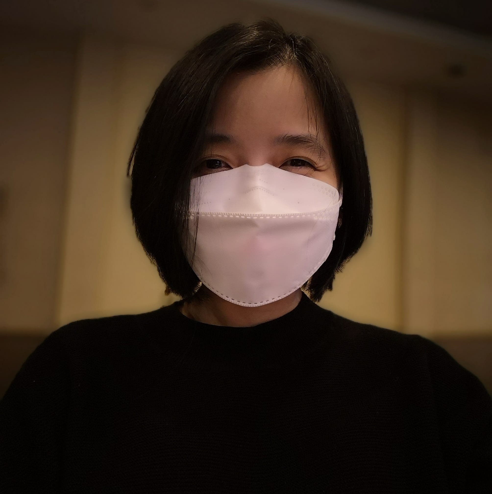

---
# Feel free to add content and custom Front Matter to this file.
# To modify the layout, see https://jekyllrb.com/docs/themes/#overriding-theme-defaults

layout: home
---
 I am an Associate Professor at the Department of Mathematics and Statistics, and the Assistant Dean for Research and Advanced Studies (ADRAS) of the College of Science at [De La Salle University (DLSU)](https://www.dlsu.edu.ph/). I am a research fellow of the [Mathematical and Statistical Modeling Unit](https://www.dlsu.edu.ph/colleges/cos/departments/mathematics/mathematical-and-statistical-modeling-unit/) of the Center for Natural Sciences and Environmental Research (CENSER) Research Center, College of Science, DLSU, and also a member of the the [Center for Complexity and Emerging Technologies (COMET)](https://comet.dlsu.edu.ph/) of the Advanced Research Institute for Informatics, Computing, and Networking (AdRIC) Research Center, College of Computer Studies, DLSU. My research interests are Systems Biology, Graph Theory, and Mathematical Modeling.

I earned my doctorate degree in systems biology and bioinformatics at Rostock University in Germany. I hold the Br. C. John Lynan FSC Professorial Chair in Mathematics, and the Br. Albinus Peter FSC Professorial Chair in Mathematics, at DLSU. I am a member of the National Research Council of the Philippines (NRCP), and Society for Industrial and Applied Mathematics (SIAM). I won the Outstanding Scientific Paper Award, Philippines National Academy of Science and Technology in 2020, Open Arms Travel Grant, International Congress of Mathematicians/International Mathematical Union in 2018, Best Paper Presentation Award
IEEE 9th International Conference on Information, Intelligence, Systems & Applications in 2018, Travel Grant, The Abdus Salam International Centre for Theoretical Physics in 2016, Best Presentation Award, and Hands-On Research in Complex Systems School in 2016. If you are interested to collaborate, please contact me via email.

Font-awesome : 
<i class="fa fa-check"></i>   
<i class="fa-solid fa-book"></i>   
<i class="fa-solid fa-memo"></i>   
<i class="fa-solid fa-presentation-screen"></i>   
<i class="fa-solid fa-keynote"></i>   
Academicons : 
<i class="ai ai-researchgate"></i>   
<i class="ai ai-google-scholar"></i>   